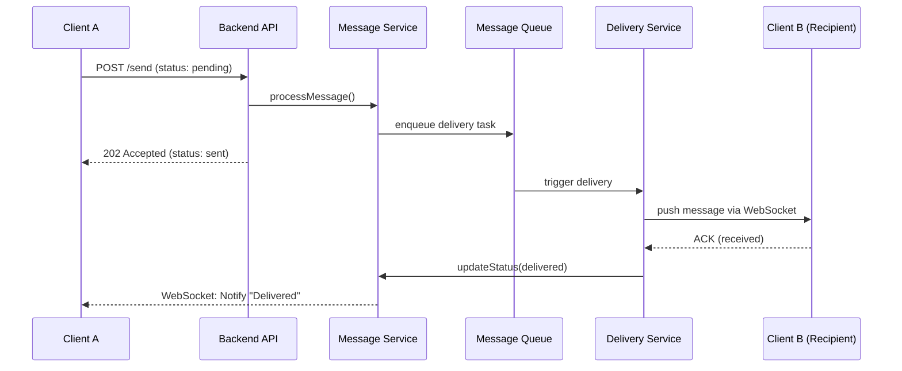
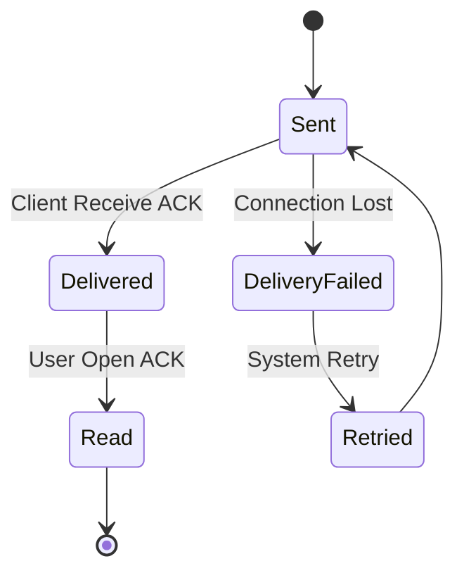

📨 Software Design and Documentation | Lab 1.1

> **Topic:** Message System Architecture  
> **Variant:** #2 — Message Status Tracking (Lifecycle & ACKs)


---

**🛠 1. Component Diagram**

Ця діаграма описує архітектуру системи та взаємодію основних компонентів для забезпечення життєвого циклу повідомлення.

```mermaid
graph DR
    Client[Web / Mobile Client] -- "1. Send Message" --> API[Backend API]
    Client -- "4. Send ACK (Delivered/Read)" --> API
    
    API --> MS[Message Service]
    
    MS -- "2. Create Message (Status: Sent)" --> DB[(Messages DB)]
    MS -. "5. Update Status (Sent -> Delivered -> Read)" .-> DB
    
    MS --> Queue[Message Queue]
    Queue --> DS[Delivery Service]
    DS --> WS[WebSocket / Push Service]
    
    WS -- "3. Push Notification" --> Client
```
---

**🔄 2. Sequence Diagram**

Детальна логіка передачі даних та обробки підтверджень (Acknowledgements) між відправником та отримувачем.



---

**🚦 3. State Diagram**

Опис станів об'єкта Message та логіки переходів між ними.



---

# ADR-001: Client-Driven Message Status Tracking

## Status
Accepted

## Context
Standard server-side tracking cannot guarantee that a message was actually received or seen on the user's device.

## Decision
Implement a lifecycle (Sent -> Delivered -> Read) managed via asynchronous Client Acknowledgements (ACKs) sent back to the API.

## Alternatives
- Server-side optimistic tracking (rejected: unreliable)
- Client polling for status (considered: rejected due to high battery/data usage)

## Consequences
+ High accuracy of delivery and read receipts  
+ Robust handling of offline/online transitions  
- Increased API traffic due to frequent ACK signals
