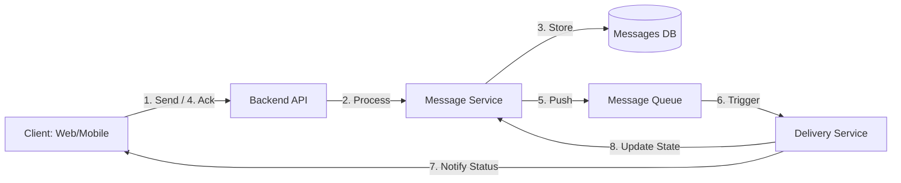

# Software-Design-and-Documentation_lab-1.1|||

```mermaid
graph LR
    Client[Client: Web/Mobile] -- 1. Send / 4. Ack --> API[Backend API]
    API -- 2. Process --> MS[Message Service]
    MS -- 3. Store --> DB[(Messages DB)]
    MS -- 5. Push --> Queue[Message Queue]
    Queue -- 6. Trigger --> DS[Delivery Service]
    DS -- 7. Notify Status --> Client
    DS -- 8. Update State --> MS
```
