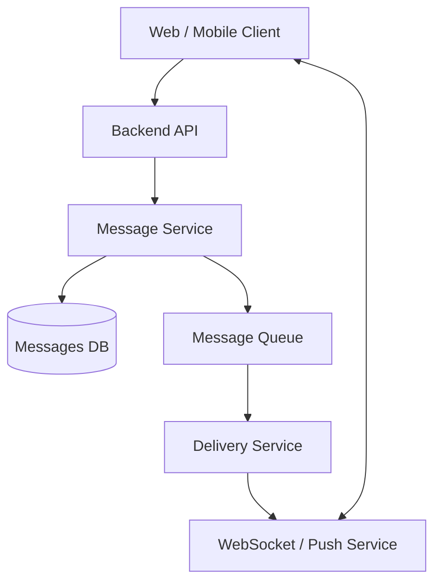
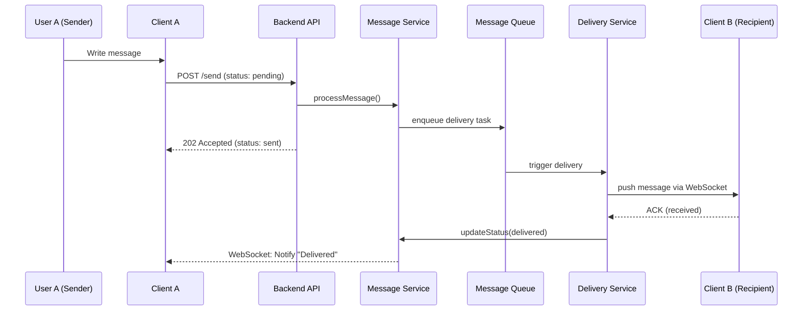
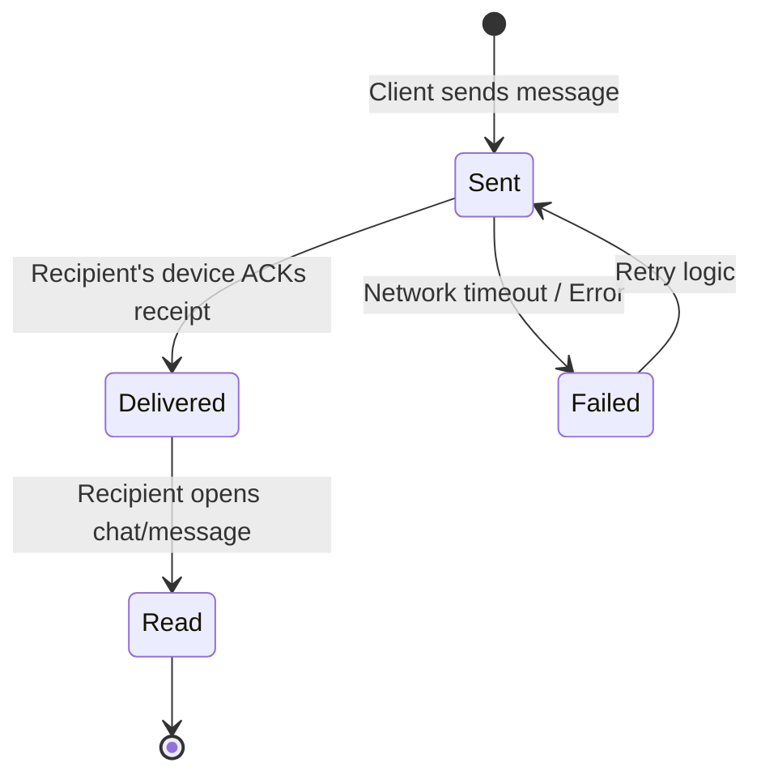

# Software-Design-and-Documentation_lab-1.1|||

Status
Accepted

Context
Нам потрібно гарантувати точне відображення статусів повідомлень. Сервер може знати, що він відправив повідомлення, але тільки клієнт може підтвердити, що воно було отримане (delivered) або прочитане (read).

Decision
Who updates status: Клієнтська програма ініціює оновлення, надсилаючи короткі повідомлення-підтвердження (ACK) через API або WebSocket.

Missing Acknowledgements: Якщо сервер не отримує delivered протягом певного часу, повідомлення вважається "в черзі". При наступному підключенні клієнта (B), система проводить синхронізацію і повторно надсилає відсутні ACKs.

Alternatives
Server-only tracking: Сервер ставить статус delivered одразу після відправки в сокет. (Відхилено: не гарантує, що додаток на телефоні реально отримав дані).

Polling: Клієнт постійно запитує, чи є нові статуси. (Відхилено: надто велике навантаження на батарею та мережу).

Consequences
+ Висока точність статусів (як у Telegram/WhatsApp).

- Збільшення кількості дрібних запитів до API (необхідна оптимізація через batching підтверджень).
